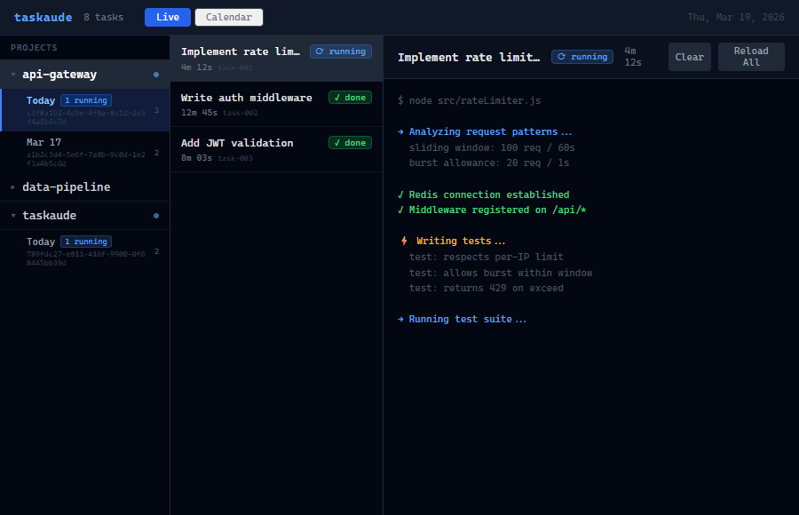

# taskaude

Browser-based monitor for Claude Code background tasks.

Claude Code can run dozens of subagents at once. Each one spins up, does work, writes output to a temp file, and finishes — or fails, or hangs. There's no native way to watch them. You find out whenever you remember to check.

Taskaude fixes that.



## What it does

- **Live output streaming** — watches Claude's task files via chokidar, streams updates over SSE
- **ANSI color rendering** — output renders with full terminal colors
- **Project tree** — groups sessions under project names, collapsible, sorted by date
- **3-panel layout** — projects left, tasks middle, output right
- **Calendar view** — browse any past day's tasks, backed by Postgres
- **Status detection** — infers running / done / failed from output patterns

## Requirements

- Node.js 18+
- Claude Code (generates the task files this monitors)
- PostgreSQL (optional — only needed for calendar/history view)

## Setup

```bash
git clone https://github.com/ibrahimokdadov/taskaude.git
cd taskaude
npm install
```

Copy `.env.example` to `.env` and set your Postgres credentials if you want the calendar view:

```bash
cp .env.example .env
```

```env
PGHOST=localhost
PGPORT=5432
PGUSER=postgres
PGPASSWORD=your_password
PGDATABASE=taskaude
```

## Running

**Dev mode** (Vite + Express with hot reload):

```bash
npm run dev
```

Opens at `http://localhost:5173`. Backend runs on port 3737.

**Production:**

```bash
npm run build
npm start
```

## Tests

```bash
PGPASSWORD=your_password npm test
```

DB integration tests require a running Postgres instance. The test suite uses `taskaude_test` as the database name and creates it automatically.

## Stack

- **Backend** — Node.js, Express, chokidar (file watcher), SSE
- **Frontend** — React, Vite, Tailwind CSS, ansi-to-html
- **Persistence** — PostgreSQL via `pg`
- **Tests** — Vitest

## How it works

Claude Code writes task output to temp files under a path like:

```
%LOCALAPPDATA%\Temp\claude\<project-hash>\<session-id>\tasks\<task-id>.output
```

Taskaude watches all of these with chokidar, reads changes, and streams them to the browser over SSE. When a task goes idle, the full output is persisted to Postgres so you can browse it later via the calendar view.
